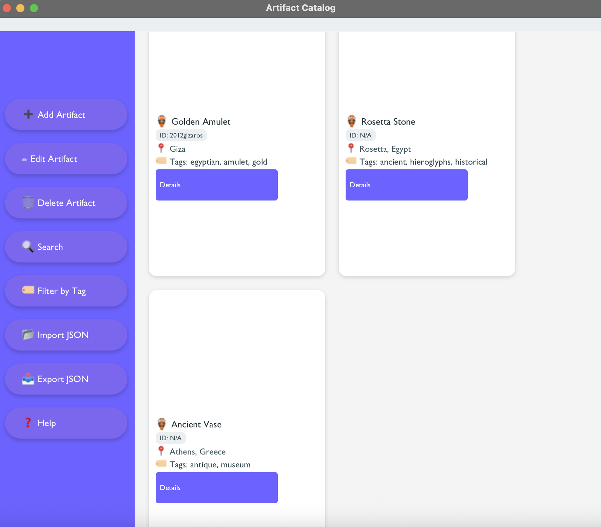

# CE216 - Historical Artifact Catalog

- This application developed for cataloging historical artifacts.

## Table of Contents
- [Features](#features)
- [Usage](#usage)
- [Contributors](#contributors)

1. ## Features
- 🏺 Create, edit, and delete artifact records
- 🔍 Advanced search and filtering by tags/categories
- 📁 JSON import/export functionality
- 🖼️ Image attachment support
- 📚 Comprehensive help manual
- 🏷️ Tag-based artifact organization

## Usage
2.1 **Using the Installer**:
   - Download the `ArtifactCatalogSetup.exe` from releases
   - Run the installer and follow the instructions
   - A desktop shortcut will be created automatically

2.2 **Using the Application:**
   - # CE216 Artifact Catalog

-This is our application's main screen. You can see the features at sidebar.

-You can add,edit and delete artifacts.

-Search bar is available if you need to look up spesific things.

-Also you can filter artifacts by their tags. All tags will be listed. You can select each of them.

-You can import or export your files.

-Lastly if you feel lost or you need help, you can fild detailed information at our help center.

3. ## Contributors
- Yasemin Güler koçar
- Meltem Demir
- Emiray Durmaz
- Betül Sinem Çetiner
